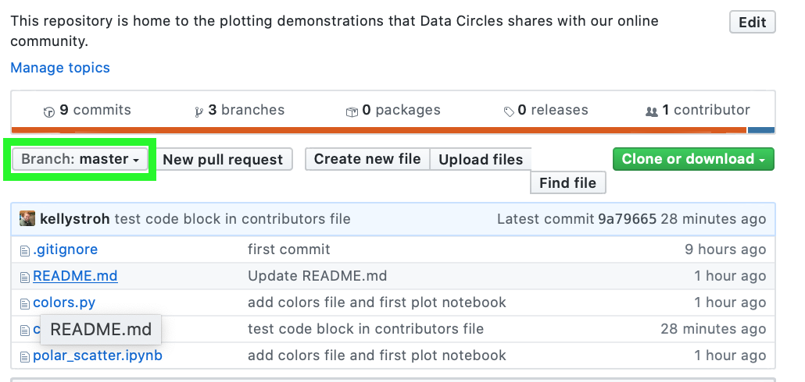
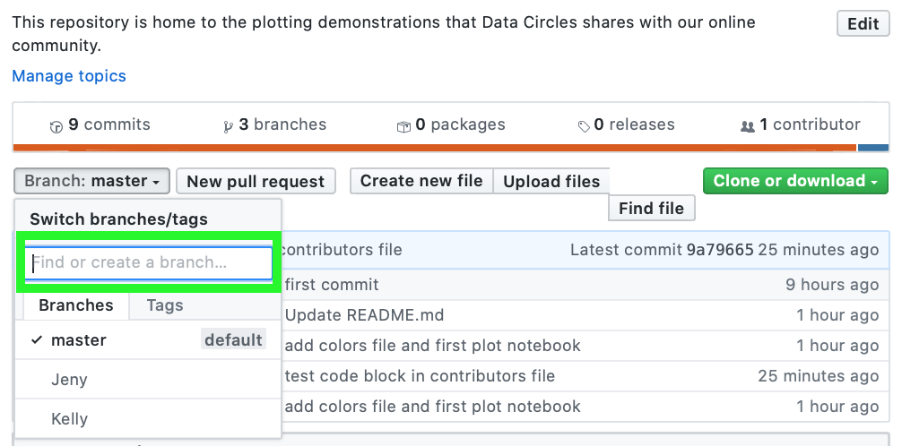
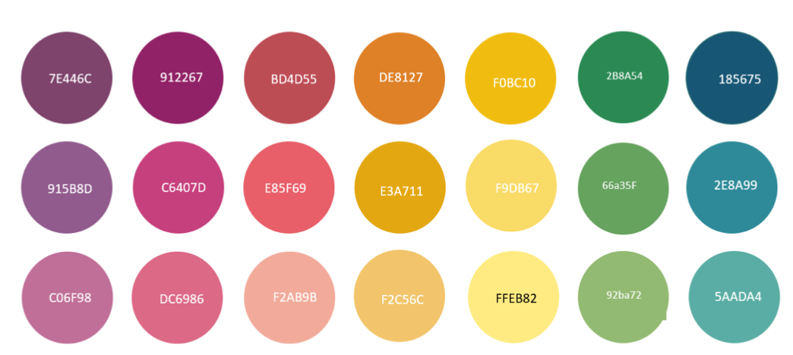
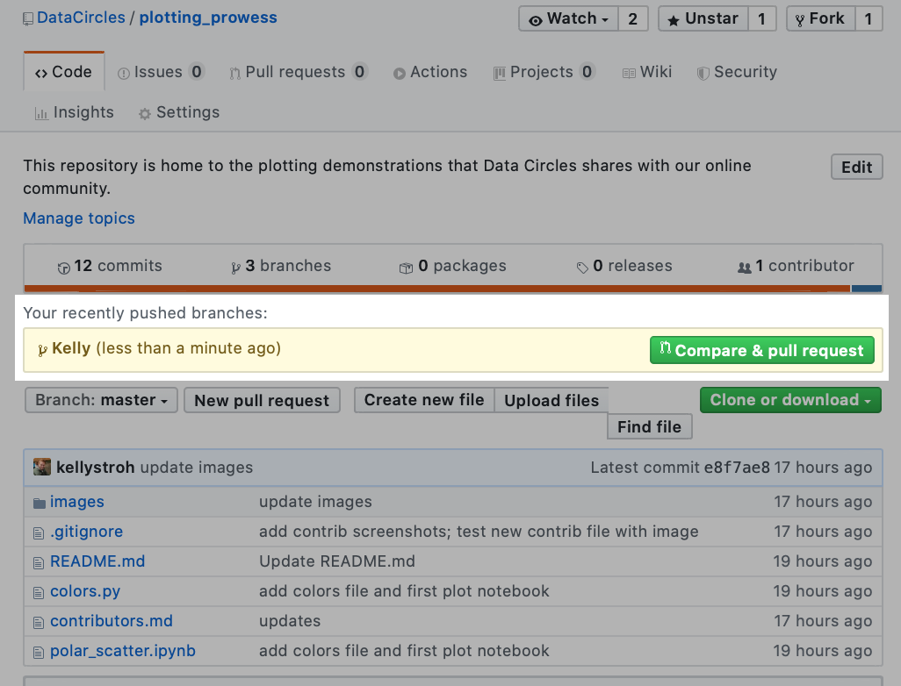
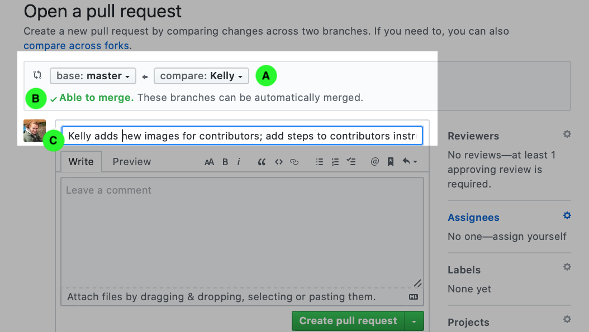
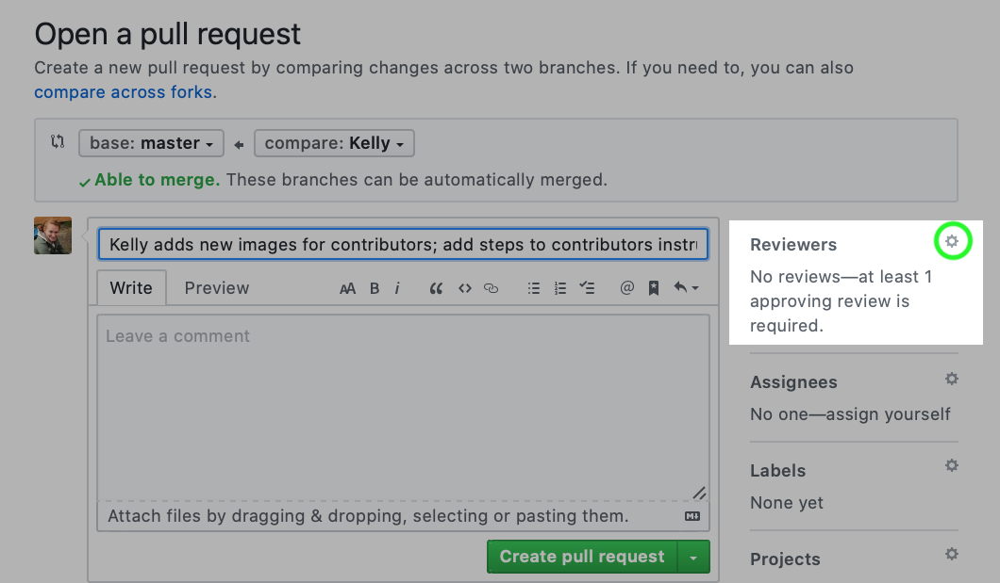
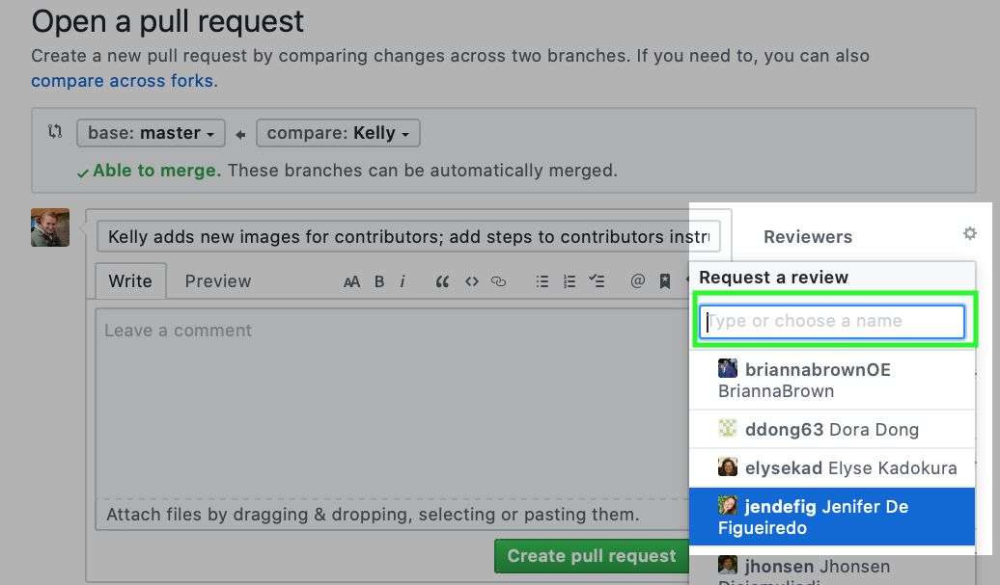

# Contributors Guide

Welcome to the team! Here are the steps to make contributions to this repo:

1. Make yourself a branch:

A:  Click here 

B: Type here


2. Clone the repo to your local machine:  
```git clone https://github.com/DataCircles/plotting_prowess.git```

3. Move to your branch:
```git checkout <your branch>```

4. Make a new notebook: 
```code <your filename>.ipynb```

5. Run jupyter notebook & plot away! 

A: To move your data into the repo, make a directory called 'data'. This is already included in the .gitignore file, so anything placed into this folder will automatically be ignored by GitHub. This is because GitHub is not designed for data storage, and doesn't allow files above 100 MB. We suggest using data available online, so that you can include instructions for others to access the data needed to reproduce your plots. 

B: Don't forget the Data Circles colors. You can import color options from colors.py. 

To use the ready-made cmap, add this code to your notebook:
```python
from colors import Color_Coded
cc = Color_Coded()
cmap = cc.color_map()
```

Alternatively, you can load a dictionary to get the hex color codes for our colors. 

```python
from colors import Color_Coded
cc = Color_Coded()
# You can use the dictionary with all colors, or choose from light, medium, or dark. 
all_colors_dict = cc.dct()
dark_colors_dict = cc.dct(theme='dark')
medium_colors_dict = cc.dct(theme='medium')
light_colors_dict = cc.dct(theme='light')
```
6. When your plot is complete, please save it as a PNG & add it to images folder in your branch of the repo. In a jupyter notebook, you can right click on the plot and save it. 

7. When you are ready to share your work, commit changes to your branch. 

Double check that you are in your branch. 
```git branch```
Check the status of your branch.
```git status```
Add your file(s). 
```git add <your filename>.ipynb```
```git add <other files>```
Commit changes to your branch.
```git commit -m 'quick summary of changes for your commit message'```
Push changes to your remote branch (on GitHub).
```git push```

8. Open the Repo on GitHub : https://github.com/DataCircles/plotting_prowess.

9. You should see your branch highlighted as a "recently pushed branch" (you may need to refresh page). Click the green button for "Compare & pull request". 


10. The next page should automatically populate this information, but it is worth checking three points. A: You should see "compare: <your name>". B: You should see "Able to merge". C: You should see your commit message; if needed, add details to explain the changes you're commiting.


11. Click the gear icon by "Reviewers". You will be able to type in or click on other users. Please select *kellystroh* or *jendefig*. 



12. Click "Create pull request". One of us will review and approve your changes as soon as possible. 