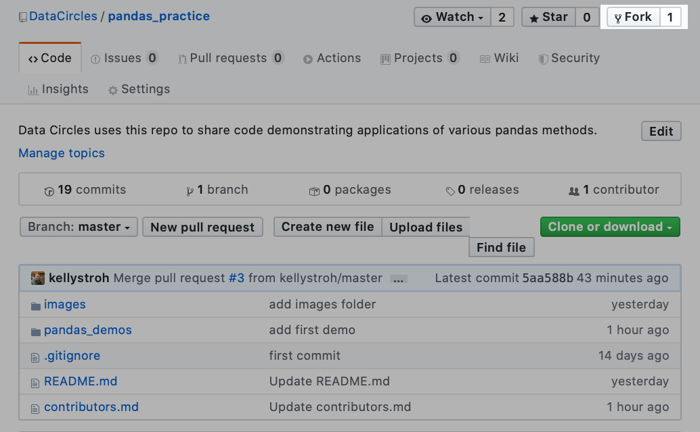
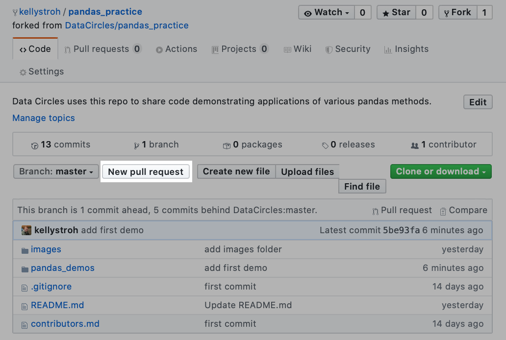
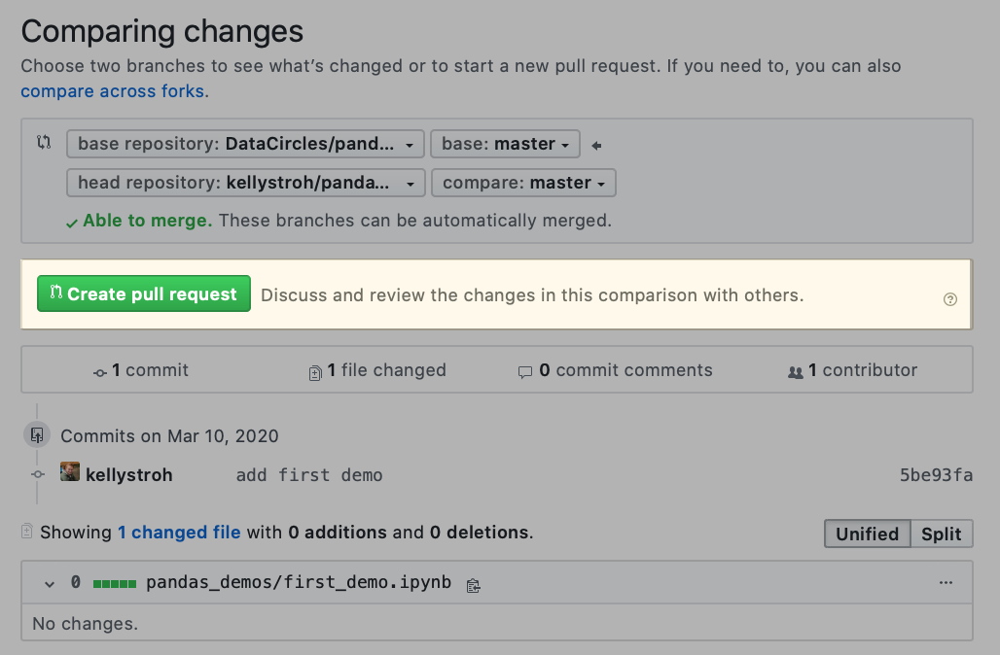
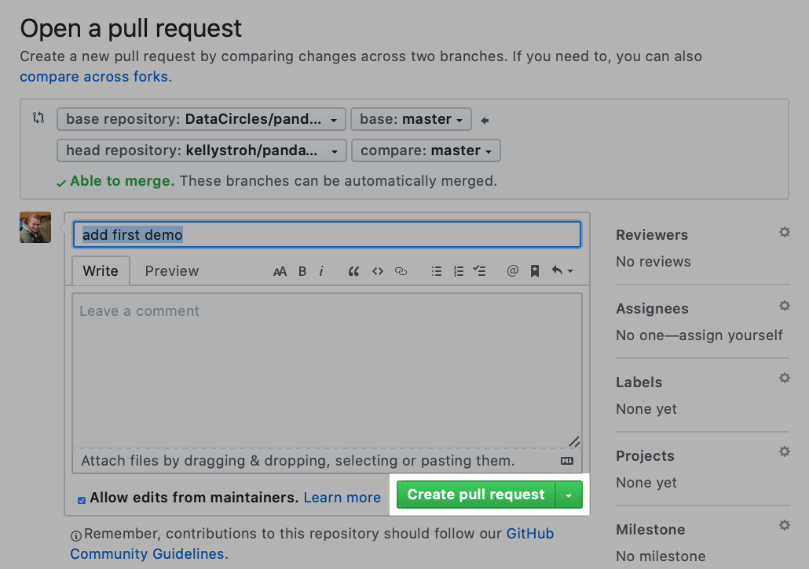

# Contributors Guide

Welcome to the team! Here are the steps to make contributions to this repo:

1. Fork the repository:



2. Clone the repo to your local machine:  
```git clone <link to your fork>```

3. Navigate into the cloned repo & add the Data Circles repo as upstream :

```cd plotting_prowess```

```git remote add upstream https://github.com/DataCircles/plotting_prowess.git```

4. Navigate into **plot_code** & start coding. Feel free to copy the Demo notebook to get started! 

```cd pandas_demos```

```cp Demo.ipynb <your filename>.ipynb```

##### Topic
Please name your notebook after the primary method that you will focus on. You are welcome to provide a demonstration of any plotting technique(s). We suggest looking through the existing examples in the Table of Contents to avoid duplication. This is intended for readers and contributors at all skill levels, so there is no wrong choice! 

##### Data
To move your data into your local repo, make a directory called 'data'. This is already included in the .gitignore file, so anything placed into this folder will automatically be ignored by GitHub. This is because GitHub is not designed for data storage, and doesn't allow files above 100 MB. We suggest using data available online, so that you can include instructions for others to access the data needed to reproduce your code. 

##### Don't forget the Data Circles colors. You can import color options from colors.py. 

To use the ready-made cmap, add this code to your notebook:
```python
from colors import Color_Coded
cc = Color_Coded()
cmap = cc.color_map()
```

Alternatively, you can load a dictionary to get the hex color codes for our colors. 

```python
from colors import Color_Coded
cc = Color_Coded()
# You can use the dictionary with all colors, or choose from light, medium, or dark. 
all_colors_dict = cc.dct()
dark_colors_dict = cc.dct(theme='dark')
medium_colors_dict = cc.dct(theme='medium')
light_colors_dict = cc.dct(theme='light')
```

6. When you are ready to share your plot, please save it as a PNG & add it to images folder in your branch of the repo. In a jupyter notebook, you can right click on the plot and save it. 

7. Next, commit changes to your fork. 

Check the status of your local repo.
```git status```
Add your file(s). 
```git add <your filename>.ipynb```
```git add images/<your plot image>.png```
```git add <other files>```
Commit changes to your fork.
```git commit -m 'quick summary of changes for your commit message'```

8. Open your fork of the repo on GitHub. Click the button for "New pull request". 


9. The next page should automatically populate this information, but it is worth checking two points. A: You should see that the base repository is **DataCircles/plotting_prowess** and the head repository is your fork. B: You should see "Able to merge", unless there are any merge conflicts.


10. On the next page, you should see your commit message. Feel free to add details if needed. Click "Create pull request" once more. One of us will review and approve your changes as soon as possible. 

