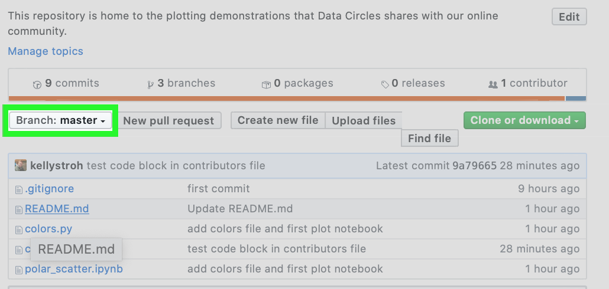
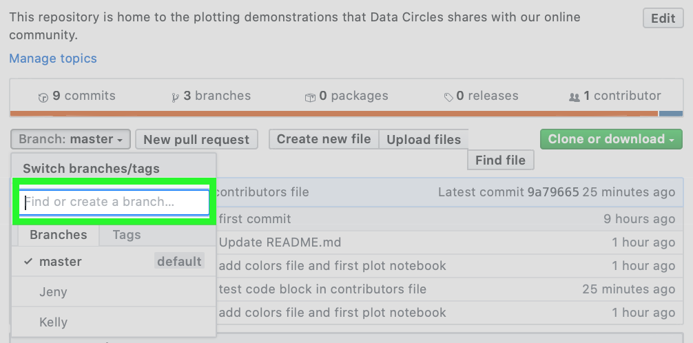

# Contributors Guide

Welcome to the team! Here are the steps to make contributions to this repo:

1. Make yourself a branch:

A:  Click here 

B: Type here


2. Clone the repo to your local machine:  
```git clone https://github.com/DataCircles/plotting_prowess.git```

3. Move to your branch:
```git checkout <your branch>```

4. Make a new notebook: 
```code <your filename>.ipynb```

5. Run jupyter notebook & plot away! 

Don't forget the Data Circles colors. You can import color options from colors.py. 

To use the ready-made cmap, add this code to your notebook:
```python
from colors import Color_Coded
cc = Color_Coded()
cmap = cc.color_map()
```

Alternatively, you can load a dictionary to get the hex color codes for our colors. 

```python
from colors import Color_Coded
cc = Color_Coded()
# You can use the dictionary with all colors, or choose from light, medium, or dark. 
all_colors_dict = cc.dct()
dark_colors_dict = cc.dct(theme='dark')
medium_colors_dict = cc.dct(theme='medium')
light_colors_dict = cc.dct(theme='light')
```

6. When you are ready to share your work, commit changes to your branch. 

Double check that you are in your branch. 
```git branch```
Check the status of your branch.
```git status```
Add your file(s). 
```git add <your filename>.ipynb```
```git add <other files>```
Commit changes to your branch.
```git commit -m 'quick summary of changes for your commit message'```
Push changes to your remote branch (on GitHub).
```git push```

7. Open the Repo on GitHub : https://github.com/DataCircles/plotting_prowess.


